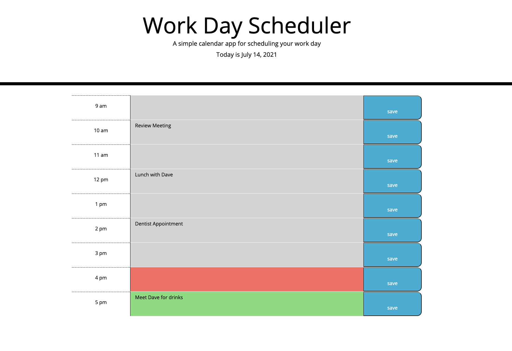

# Work Day Scheduler

## Objective
Have trouble keeping track of meetings or plans? This app allows the user to input events into their work day planner and save the event for when they re-open the page. By using moment.js the planner gives an updated date at the top of the page, and also color coordinate each timeblock based on the current time. If the timeblocks are past the current hour, the text area will be gray. The timeblocks that haven't happened yet are shown in green, and if the timeblock matches the current hour, the text area will be red. 

## Technologies Used
* HTML
* Javascript
* CSS
* Moment.js

## Links
* Deployed Site: https://evapopp.github.io/day-planner/
* Repo: https://github.com/evapopp/day-planner

## Page Preview

